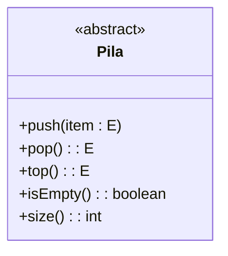

# Tema 1: Interfaces y Genericidad parametrica


* primer parcial: 30/9
* segundo parcial: 11/9
* entrega proyecto: 18/11
* recuperatorio: sabado 25/11
* Re-entrega 27/11

## Interfaces

>En Java, una interfaz es una colección de métodos (métodos sin implementación, pero no abstractos) que se utilizan para definir un contrato o conjunto de comportamientos que una clase concreta debe implementar. Las interfaces permiten la implementación de múltiples herencias, lo que facilita la creación de clases que puedan cumplir múltiples roles o funcionalidades.

1. Definicion de una interfaz:
```java
    public interface MiInterfaz{
        void metodo1();
        int metodo2(String parametro);
    }
```
1. Implementacion de una interfaz en una clase:

```java
    public class MiClase implements MiInterfaz{
        public void metodo1(){}

        public int metodo2(String Parametro){
            return 0;
        }
    }
```

3. Uso de una interfaz en Main:

```java
    public class Principal{
        public static void main(String[] args){
            MiInterfaz instancia = new MiClase();
            instancia.metodo1();
            int resultado = instancia.metodo2("Hola");
        }
    }
```
* En eclipse estos archivos pueden quedar distribuidos sencillamente como:
    (tener en cuenta importar `package proyectointerfaz;`)

        └── src/
            └── proyectointerfaz/
                ├── MiInterfaz.java
                ├── MiClase.java
                └── Principal.java


*  **Obs importante:** cuando accedes a través de la variable de tipo interfaz, solo podrás acceder a los métodos definidos en la interfaz.

```java
public interface MiInterfaz {
    void metodoInterfaz();
}

public class MiClase implements MiInterfaz {
    public void metodoInterfaz() {
        System.out.println("Método de la interfaz implementado");
    }
    
    public void metodoClase() {
        System.out.println("Método de la clase");
    }
}

public class Main {
    public static void main(String[] args) {
        MiInterfaz miVariable = new MiClase();
        
        miVariable.metodoInterfaz(); // Método de la interfaz implementado
        //miVariable.metodoClase(); // Esto no compilará, ya que el método no está en la interfaz
    }
}
```
>En este ejemplo, la clase `MiClase` implementa la interfaz `MiInterfaz` y proporciona su propia implementación del método `metodoClase()`. En el método `main()`, puedes ver que puedes acceder al método `metodoInterfaz()` a través de la variable `miVariable`, que es de **tipo `MiInterfaz`**. Sin embargo, si intentas acceder al método `metodoClase()`, obtendrás un error de compilación, **ya que ese método no está declarado en la interfaz**.

## Genericidad Parametrica

> Genericidad: La genericidad es una técnica que permite definir clases, interfaces y métodos que pueden trabajar con varios tipos de datos de manera segura y flexible. Antes de la introducción de la genericidad en Java, si querías escribir una estructura de datos (como una lista o un conjunto) que almacenara elementos de diferentes tipos, tendrías que crear una versión de esa estructura para cada tipo de dato, lo que resultaba en código duplicado y menos mantenible. **Usa la relacion ES-UN al igual que la Herencia**

la *Genericidad Parametrica*  es un enfoque en el que se utiliza un tipo generico o parametro de tipo para definir una clase, interfaz o metodo. Esto permite que el mismo codigo fincione con varios tipos de datos diferentes. En Java, se utilizan los corchetes angulares `<T>` para indicar un tipo generico

```java
public class MiClase<T>{
    //...
}
```
> aquí `T` es un parametro de tipo generico. 
 
Se puede usar `T` como un tipo de dato real dentro de la clase `MiClase` pero no esta definido hasta que se instancie la clase con un tipo especifico. 
* Al crear una instancia de `MiClase` con un tipo especifico podria ser:

```java
    MiClase<Integer> instancia = new MiClase<>();
    // Esto significa que la clase queda definida para trabajar con valores de tipo Integer.
```

>La genericidad paramétrica mejora la seguridad del tipo en el código (evita errores de tipo en tiempo de compilación) y promueve la reutilización del código al máximo. Permite que una sola implementación maneje múltiples tipos de datos, lo que lleva a un código más limpio, más eficiente y más fácil de mantener.


### *Ejemplo*: implementando genericidad parametrica en una clase `MiClase`


```java

public class MiClase<T> {
    private T contenido;

    public MiClase(T contenido) {
        this.contenido = contenido;
    }

    public T getContenido() {
        return contenido;
    }

    public void setContenido(T contenido) {
        this.contenido = contenido;
    }

    public void imprimirTipo() {
        System.out.println("El tipo de contenido es: " + contenido.getClass().getSimpleName());
    }
}

```

* Esta clase puede ahora ser usada con diferentes tipos de datos:
  
```java

public class Principal {
    public static void main(String[] args) {
        MiClase<Integer> instanciaEntero = new MiClase<>(42);
        instanciaEntero.imprimirTipo(); 
        // Imprimirá "El tipo de contenido es: Integer"

        MiClase<String> instanciaString = new MiClase<>("Hola");
        instanciaString.imprimirTipo(); 
        // Imprimirá "El tipo de contenido es: String"
    }
}

```
****

# Interfaz usando Genericidad Parametrica

* *Ejemplo*:  
1. implementamos una interfaz pero ahora es con genericidad parametrica

```java
public interface MiInterfaz<T> {
    void agregar(T elemento);
    T obtener(int indice);
}
```
>En este ejemplo, la interfaz `MiInterfaz` se declara con un parámetro de tipo genérico `T`. Los métodos agregar y obtener también utilizan este tipo genérico para indicar el tipo de datos con el que la interfaz debe trabajar. 

2. Implementamos la interfaz de la siguiente manera:

```java
public class MiClase<T> implements MiInterfaz<T> {
    private Object[] elementos;
    private int tamaño;
    private static final int CAPACIDAD_INICIAL = 10; // Capacidad inicial del arreglo

    public MiClase() {
        elementos = new Object[CAPACIDAD_INICIAL];
        tamaño = 0;
    }

    @Override
    public void agregar(T elemento) {
        if (tamaño == elementos.length) {
            redimensionarArreglo();
        }
        elementos[tamaño++] = elemento;
    }

    @Override
    public T obtener(int indice) {
        if (indice >= 0 && indice < tamaño) {
            return (T) elementos[indice];
        }
        throw new IndexOutOfBoundsException("Índice fuera de rango");
    }

    private void redimensionarArreglo() {
        int nuevaCapacidad = elementos.length * 2;
        Object[] nuevoArreglo = new Object[nuevaCapacidad];
        System.arraycopy(elementos, 0, nuevoArreglo, 0, tamaño);
        elementos = nuevoArreglo;
    }
}


```
* En este ejemplo, la clase `MiClase` implementa la interfaz `MiInterfaz` utilizando la genericidad paramétrica. Esto permite que `MiClase` trabaje con cualquier tipo de dato que desees.
  
3. Luego, utilizar la interfaz y la clase implementadora de esta manera:
```java
public class Principal {
    public static void main(String[] args) {
        MiInterfaz<String> instanciaString = new MiClase<>();
        instanciaString.agregar("Hola");
        String resultadoString = instanciaString.obtener(0);

        MiInterfaz<Integer> instanciaInteger = new MiClase<>();
        instanciaInteger.agregar(42);
        int resultadoInteger = instanciaInteger.obtener(0);
    }
}
```
* En este ejemplo, creamos instancias de `MiClase` a través de la interfaz `MiInterfaz` con tipos de datos diferentes (String e Integer). La genericidad paramétrica en la interfaz y la clase implementadora permite que puedas trabajar con **diferentes tipos de datos** utilizando el mismo código.

**Obs:** *@Override es una anotación en Java que se utiliza antes de un método para indicar que estás sobrescribiendo un método de una clase padre o una interfaz. En otras palabras, estás proporcionando una implementación específica para ese método en la clase actual.*

**Obs:** *tipo estatico tiene que ser igual al tipo de la interfaz: si pones el tipo estatico que necesitas, solo podras mandarle mensajes del tipo que puede recibir*
- - -

`super.f()` es el constructor de la instancia anterior, es la inmediata anterior nunca puede saltar clases.

arreglo de objetos con genericidad de herencia.


---

## recursividad: recorrido de arreglos

* **CR:** e pertenece a `A` si `e` es igual al ultimo elemento de `A` o si `e` pertenece a `A'`.
  * donde `A'` es `A` sin el ultimo elemento.

* **CB:** si `A'` no tiene elementos entonces `e` no pertenece a `A`

```java
public boolean perteneceRecursivo(E e){
   return perteneceRec(e, elements.length);
}
//metodo privado perteneceRec(e, A.length)
private boolean perteneceRec(E e, int n){
    boolean res ;
    if(n == 0){
      res= false;
    }else{
        res = elements[n-1].equals(e) ||perteneceRec(e, n-1);
    }
    return res;
}
```

## try catch en java 

algunos de los tipos de excepciones más comunes en Java:

1. NullPointerException (NullPointerException): Ocurre cuando intentas acceder a un objeto o método en un objeto que es null.

2. ArithmeticException (ArithmeticException): Se lanza cuando ocurre un error en una operación aritmética, como la división entre cero.

3. ArrayIndexOutOfBoundsException (ArrayIndexOutOfBoundsException): Se produce cuando intentas acceder a un índice fuera del rango válido en un array.

4. IndexOutOfBoundsException (IndexOutOfBoundsException): Es la clase base para excepciones de índice fuera de rango, como ArrayIndexOutOfBoundsException y StringIndexOutOfBoundsException.

5. NumberFormatException (NumberFormatException): Se arroja cuando intentas convertir una cadena en un tipo numérico, pero la cadena no tiene el formato adecuado.

6. ClassCastException (ClassCastException): Lanzada cuando intentas convertir un objeto a un tipo incompatible en tiempo de ejecución.

7. IllegalArgumentException (IllegalArgumentException): Se arroja cuando se pasa un argumento ilegal o inapropiado a un método.

8. FileNotFoundException (FileNotFoundException): Se arroja cuando se intenta acceder a un archivo que no se encuentra en el sistema.

9. IOException (IOException): Es la clase base para excepciones de entrada/salida. Incluye situaciones como problemas en la lectura o escritura de archivos.

10. RuntimeException (RuntimeException): Es la clase base para excepciones que generalmente están relacionadas con errores en la lógica del programa y pueden ser evitadas con un mejor diseño y manejo.

```java
public class ExceptionExample {
    public static void main(String[] args) {
        String[] numbers = {"10", "20", "30", "forty", "50"};
        
        try {
            for (int i = 0; i <= numbers.length; i++) {
                int parsedNumber = Integer.parseInt(numbers[i]);
                System.out.println("Parsed number: " + parsedNumber);
            }
        } catch (NumberFormatException e1) {
            System.out.println("NumberFormatException: Unable to parse a number.");
        } catch (ArrayIndexOutOfBoundsException e2) {
            System.out.println("ArrayIndexOutOfBoundsException: Index is out of range.");
        } catch (NullPointerException e3) {
            System.out.println("NullPointerException: Array reference is null.");
        }
        
        System.out.println("Program completed.");
    }
}

```


# TDA: tipo de dato abstracto *(Abstract Data Type)*

> **TDA:** es un tipo definido solamente en términos de sus operaciones y de las restricciones que valen entre las operaciones. *se definen en terminos de su representacion conceptual y sus operaciones*


## Pila (Stack): 
Colección lineal de objetos actualizada en un extremo llamado tope usando una política LIFO (last-in first-out, el primero en entrar es el último en salir, el ultimo que ingresa es el primero que sale).

* Operaciones con **Pila**:
  *  `push(e)`: Inserta el elemento e en el tope de la pila
  * `pop()`: Elimina el elemento del tope de la pila y lo entrega como resultado. Si se aplica a una pila vacía, produce una situación de error.
  * `isEmpty()`: Retorna verdadero si la pila no contiene elementos y falso en caso contrario.
  * `top()`: Retorna el elemento del tope de la pila. Si se aplica a una pila vacía, produce una situación de error.
  * `size()`: Retorna un entero natural que indica cuántos elementos hay en la pila.

> Idea intuitiva de **pila**: Cada vez que se pone un elemento se pone al final y cada vez que se saca un elemento se saca del final.

## Iplementacion de PILA:

Definición de una interfaz Pila:
* Se abstrae de la ED con la que se implementará
* Se documenta el significado de cada método en lenguaje natural
* Se usa un parámetro formal de tipo representando el tipo de los elementos de la pila
* Se definen excepciones para las condiciones de error





### Uso de la clase Pila brindada por JAVA

```java

import java.util.EptyStackException;

public class main{
    public static void main(String[] args){
        Stack<String> miPila = new Stack();
        miPila.push("Hola");
        miPila.push("mundo")
        miPila.push("Cruel")
        //hasta ahí pusimos 3 elementos en la pila

        //con peek muestra pero no elimina
        if(miPila.peek() == "cruel"){
            System.out.println("la pila funciona bien")
        }else{
            System.out.println("la pila funciona mal")
        }
        // salida : la pila funciona bien
    }

    //con pop muestra y elimina
    System.out.println(miPila.pop())
    if(miPila.peek() == "mundo"){
            System.out.println("la pila funciona bien")
        }else{
            System.out.println("la pila funciona mal")
        }
        // salida : la pila funciona bien

        try{
            Stack<String> otraPIla = new Stack<>();
            String resultado = otraPila.pop();
        }
        catch( EmptyStackException e){
            System.out.println("Error: pila vacia")
        }
        //salida: Error: pila vacia
}
```

# TDA Cola (Queque):

>Una cola (queue) es una colección con modelo de secuencia cuyos datos ingresan por un extremo llamado rabo (tail) y salen por otro extremo llamado frente (head). el primero en ingresar es el primero en salir <-[1,2,3,4]<-

## Operacion Cola:
Esta política de actualización se llama FIFO (por first-in first-out) o también FCFS (first-come first-served)

* enqueue(e): Inserta el elemento e en el rabo de la cola
* dequeue(): Elimina el elemento del frente de la cola y lo
retorna. Si la cola está vacía se produce un error.
  * front(): Retorna el elemento del frente de la cola. Si la cola
está vacía se produce un error.
* isEmpty(): Retorna verdadero si la cola no tiene elementos
y falso en caso contrario
* size(): Retorna la cantidad de elementos de la cola.

## Implementacion COLA:
Definición de una interfaz Cola:
* Se abstrae de la ED con la que se implementará
* Se documenta el significado de cada método en lenguaje
natural
* Se usa un parámetro formal de tipo representando el tipo de
los elementos de la cola
* Se definen excepciones para las condiciones de error

```java
public intreface Queue<E>{
    public void enqueue();
    public void dequeue();
    **completar**
}

```

### Ejemplo de uso COLA: (usando las clases que implementa la interfaz).
```java
public class main{
    public static void main(String[] args){
        Queue<String> miQueue = new LinkedList<String>();
        //estatico del tipo interfaz Queue del tipo dinamico LinkedList. 
        //todos los metodos especificados e implementados por java

        miQueue.add("Hola");
        miQueue.add("mundo")
        miQueue.add("Cruel")
        //hasta ahí pusimos 3 elementos en la cola

        //con peek muestra pero no elimina
        if(miQueue.peek() == "Hola"){
            System.out.println("la Queue funciona bien");
        }else{
            System.out.println("la Queue funciona mal");
        }
        // salida : la Queue funciona bien, la diferencia es que preguntamos por la primera add 
    }

    //con pop muestra y elimina
    System.out.println(miQueue.dequeue());
    if(miQueue.peek() == "mundo"){
            System.out.println("la Queue funciona bien");
        }else{
            System.out.println("la Queue funciona mal");
        }
        // salida : la Queue funciona bien

        try{
            Stack<String> otraQueue = new Stack<>();
            String resultado = otraQueue.pop();
        }
        catch( EmptyStackException e){
            System.out.println("Error: Queue vacia");
        }
        //salida: Error: Queue vacia
    }
}

```
# Integracion PILA y COLA (operaciones de TDA)

> se podria pensar en un simple problema: dada una Cola A [3,7,9,1]
> convertirla en una Cola [1,9,7,3].

usando como una herramienta auxiliar una pila podemos solucionar este problema 

```java
public class main{
    public static void main(String[] args){
        Queue<String> miQueue = new LinkedList<String>();


    public static void invertir(Queue<String> e){
        Stack<String> pilaAuxiliar =  new Stack<>();

        while (!e.isEmpty()){
            String elem = e.remove();
            pilaAuxiliar.add(elem);
        }
        
        while (!pilaAuxiliar.isEmpty()){
            String elem = pilaAuxiliar.pop();
            e.add(elem);
        }
    }
    }
}

```
## invertir una fila
> se podria pensar en un simple problema: dada una fila A [3,7,9,1]
> convertirla en una fila [1,9,7,3].

usando como una herramienta auxiliar una cola podemos solucionar este problema 

```java
public class main{
    public static void main(String[] args){
        Stack<String> pila = new Stack<String>();


    public static void invertir(Queue<String> e){
        Queue<String> colaAuxiliar =  new LinkedList<>();

        while (!e.isEmpty()){
            String elem = e.pop();
            colaAuxiliar.add(elem);
        }

        while (!colaAuxiliar.isEmpty()){
            String elem = colaAuxiliar.remove();
            e.add(elem);
        }
        
        
    }
    }
}

```